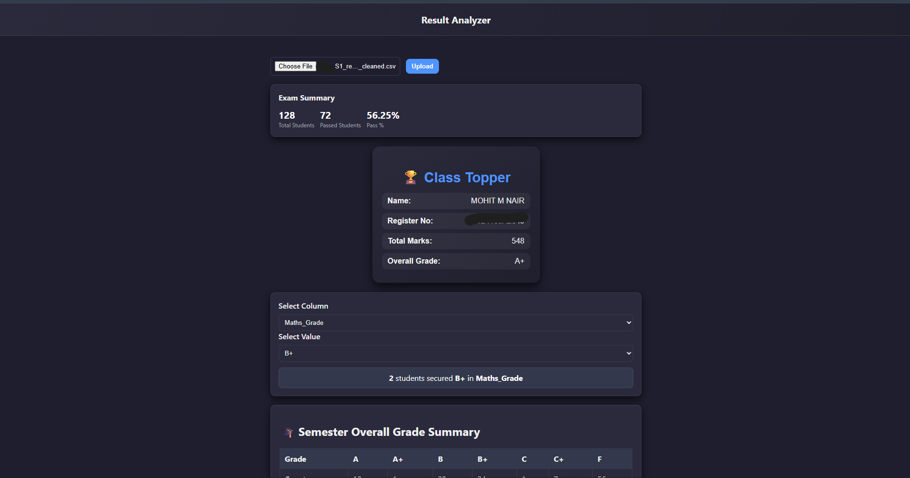

## 📘 CSV Analytics Dashboard

A full-stack app built with **React** (frontend) and **FastAPI** (backend) that lets users upload a CSV file, visualize student results, and generate insights like:

* 🎯 Pass counts & percentages per subject
* 🏅 Toppers by subject and overall
* 🎓 Semester grade distribution (from `Overall_Grade`)
* 🧠 Class topper details (from `Total` column)

## NOTE

Make sure the CSV that you gonna upload is given the kind of format in as mentioned in `data_cleaning.ipynb`

---

### 🧩 Tech Stack

**Frontend:** React + Axios + TailwindCSS
**Backend:** FastAPI + Pandas + NumPy

---

## ⚙️ Setup Instructions

### 🔹 1. Clone the Repository

```bash
git https://github.com/21lj/python_projects.git
cd resuly_analysis
```

---

### 🔹 2. Backend Setup (FastAPI)

#### Install dependencies

```bash
cd backend
pip install -r requirements.txt
```

#### Run the FastAPI server

```bash
uvicorn main:app --reload --port 8000
```

The backend will be live at 👉 **[http://localhost:8000](http://localhost:8000)**

---

### 🔹 3. Frontend Setup (React)

#### Install dependencies

```bash
cd frontend
npm install
```

#### Run React app

```bash
npm start
```

The frontend runs on 👉 **[http://localhost:3000](http://localhost:3000)**

---

## 🚀 Features Overview

| Feature            | Description                                           |
| ------------------ | ----------------------------------------------------- |
| 🧾 CSV Upload      | Upload any student result CSV                         |
| 👁️ Data Preview   | View first 100 rows after upload                      |
| 📑 Subject Summary | Pass count, percentage & toppers per subject          |
| 🎓 Overall Summary | Grade distribution from `Overall_Grade`               |
| 🏆 Class Topper    | Name, register number, total marks, and overall grade |

---

## 🗂️ Example CSV Structure

| RegisterNumber | Name    | Math_Mark | Math_Grade | Science_Mark | Science_Grade | Total | Overall_Grade |
| -------------- | ------- | --------- | ---------- | ------------ | ------------- | ----- | ------------- |
| 21CS001        | Arjun K | 95        | A+         | 92           | A             | 587   | A+            |
| 21CS002        | Meera Q | 80        | A          | 78           | B             | 510   | A             |
| ...            | ...     | ...       | ...        | ...          | ...           | ...   | ...           |

---

---
## ScreenShots




---

## 🧠 API Endpoints

| Endpoint           | Method | Description                            |
| ------------------ | ------ | -------------------------------------- |
| `/upload_csv`      | POST   | Upload and parse CSV                   |
| `/grade_columns`   | GET    | Get columns ending with “Grade”        |
| `/subject_summary` | GET    | Subject-wise pass % and toppers        |
| `/overall_summary` | GET    | Grade-wise counts from `Overall_Grade` |
| `/class_topper`    | GET    | Class topper details from `Total`      |

---

## 🧰 Requirements

See [`requirements.txt`](./requirements.txt):


---

## 💻 Demo Flow

1. Upload CSV file
2. Select subjects and view pass stats
3. View toppers and grade summaries
4. See class topper automatically calculated

---
